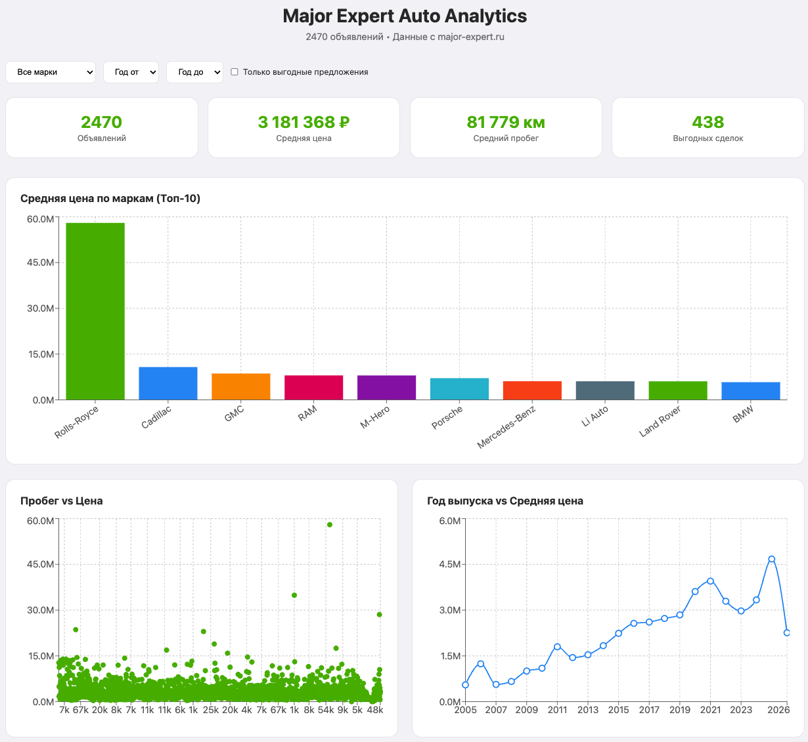

# Major Expert Auto Analytics

Дашборд по рынку авто с пробегом в Москве: свой парсер, ~2500 живых объявлений и score выгодности по каждому авто. Проект собран ИИ-агентом [OpenCode](https://opencode.ai) по одному промту, вживую на видео для канала [OnlyAnalyst](https://onlyanalyst.ru).



**Живой сайт:** http://90.156.129.73/

## Что внутри

- **Парсер** (`scraper/index.js`): Node.js + axios, тянет объявления через JSON API сайта major-expert.ru (~200 страниц), отсекает дубли по id и складывает ежедневные снапшоты цен в `data/history/`.
- **Дашборд** (`src/App.jsx`): React + Vite + Recharts. Фильтры по марке и годам, 4 графика, карточки лучших предложений.
- **Score выгодности** (`src/utils/scoreCalculator.js`): насколько цена ниже средней по марке и модели, плюс бонусы за меньший пробег и свежий год. Score выше 10 = выгодная сделка, выше 20 = отличная.
- **Автодеплой** (`.github/workflows/deploy.yml`): пуш в master, GitHub Actions по SSH пересобирает данные и обновляет сервер (nginx).

## Быстрый старт

```bash
npm install

# вариант 1: собрать свежие данные парсером (пара минут)
npm run scrape        # все страницы -> data/cars.json
npm run scrape:quick  # или только 5 страниц, для теста

# вариант 2: старт без парсинга, на сэмпле из 50 авто
cp data/cars.sample.json data/cars.json

npm run dev           # http://localhost:5173
```

## Про данные

Полный датасет в репозиторий не коммитится (это чужие объявления с ценами, выкладывать их в открытый доступ некрасиво). В репо лежит только обезличенный сэмпл `data/cars.sample.json` на 50 авто, без ссылок и фото. Свежие полные данные каждый собирает парсером сам: `npm run scrape`.

## Куда развиваем дальше

Проект живёт на сервере и обновляется автоматически, это не разовая демка. Предлагайте свои фичи в [issues](https://github.com/eeealesha/auto-analytics/issues): лучшие идеи реализуем, самые интересные разберём в следующих видео на канале. PR тоже приветствуются.

1. **Прогноз справедливой цены.** ML-модель поверх собранных данных: сколько это авто должно стоить на самом деле, переплата или скидка видна сразу.
2. **Алерты «цена упала».** История цен уже копится в `data/history/` каждый день, осталось построить график и сигналить о снижениях.
3. **Модель амортизации.** Какие марки и модели теряют в цене медленнее всех: график по возрасту.
4. **Сравнение площадок.** То же авто на Авито и Авто.ру: где реально выгоднее.
5. **Телеграм-бот.** Выгодная сделка дня по заданным фильтрам прямо в личку.
6. **Умнее score.** Учесть поколение, кузов и комплектацию, а не только пару «марка + модель».
7. **Больше источников.** Другие города и другие дилеры.
8. **Техдолг.** Вынести данные из бандла (сейчас JSON вшит в 1,8 МБ джаваскрипта), разбить `App.jsx` на компоненты, тесты, убрать неиспользуемый cheerio.

## Как поучаствовать

- **Идея или баг:** заведите [issue](https://github.com/eeealesha/auto-analytics/issues) и опишите, что хотите видеть. Самый простой путь: лучшие идеи реализуем и разберём в следующих видео.
- **Хотите сами в код:** сделайте копию репозитория кнопкой Fork, склонируйте её к себе, создайте ветку (`git checkout -b my-feature`), внесите изменения и откройте Pull Request сюда.
- **Что дальше:** PR ревьюится и мёржится в master, после мёржа GitHub Actions автоматически выкатывает изменения на живой сайт. Ваш код начинает работать в проде.

## Как это собрано

Весь проект написан ИИ-агентом OpenCode с бесплатной моделью, по промту в одно предложение. Как именно, смотрите в видео-серии про ИИ-агентов на канале [OnlyAnalyst](https://onlyanalyst.ru): установка агента, правила работы с ним и живая сборка этого дашборда.
